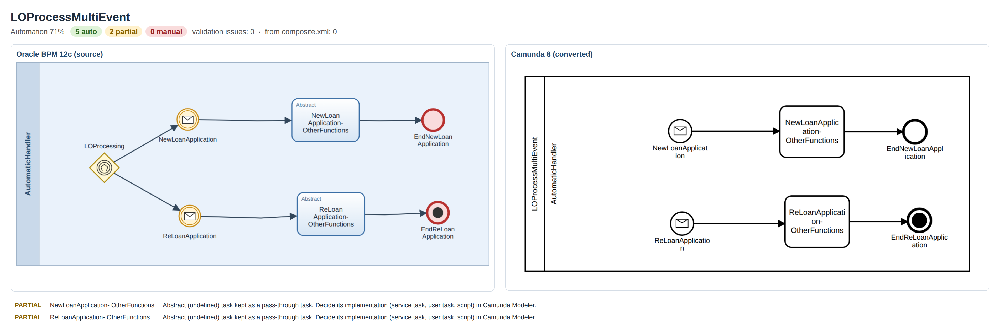

# Oracle BPM to Camunda 8 Migrator

[](https://github.com/Rahuldandotiya/OracleBpmToCamunda8MigratorTool/actions/workflows/build.yml)
[](LICENSE)

`oracle2c8` converts Oracle BPM 11g/12c processes, or whole Oracle SOA/BPM projects, into
**executable Camunda 8 BPMN** that opens in Camunda Modeler and deploys to Zeebe. Each run writes a
migration report that tells you, element by element, what was converted and what still needs a person.



*An Oracle process that starts through an event-based gateway (left) becomes two message start
events in Camunda 8 (right). Zeebe cannot start a process from an event-based gateway.*

---

## Contents

- [Why this tool](#why-this-tool)
- [Results on a real Oracle project](#results-on-a-real-oracle-project)
- [Quick start](#quick-start)
- [Migrating your own processes](#migrating-your-own-processes)
- [Learning from finished migrations (knowledge base)](#learning-from-finished-migrations-knowledge-base)
- [Command reference](#command-reference)
- [What gets converted](#what-gets-converted)
- [Reading the migration report](#reading-the-migration-report)
- [Project layout](#project-layout)
- [Building and testing](#building-and-testing)
- [Extending the converter](#extending-the-converter)
- [Credits](#credits)
- [License](#license)

## Why this tool

Oracle BPM exports are not directly usable in Camunda 8. They have no diagram information, they use
XPath and Oracle extensions, and their service calls are defined outside the process, in
`composite.xml`. `oracle2c8` handles all of that:

| Problem | What `oracle2c8` does |
| --- | --- |
| No `BPMNDiagram` in Oracle exports | Rebuilds pool, lanes, shapes and routed edges from Oracle's own layout data |
| XPath expressions and data assignments | Translates them to FEEL conditions and `zeebe:ioMapping` |
| Service calls live in `composite.xml` | Follows each call to its binding: REST → Camunda REST connector, SOAP / adapters → job workers, other BPMN components → call activities, URLs → Camunda secrets |
| Oracle start patterns Zeebe does not allow | Rewrites them, e.g. event-gateway starts and receive-task starts become message start events |
| Inbound JMS / email / file adapters | Named message start events plus a hint on which Camunda inbound connector to use |
| Oracle schedules and timers | Zeebe cron expressions and valid ISO 8601 cycles |
| Every team finishes migrations differently | Learns your team's decisions from already finished migrations and applies them to new processes |
| "How much is left?" | Rates every element AUTO, PARTIAL or MANUAL and validates the result against Camunda 8 rules |

The core library has **no runtime dependencies** (only the JDK). XML parsing is hardened against
XXE, and archive reading against zip-slip and zip bombs.

## Results on a real Oracle project

The repository ships with a real Oracle BPM 12c project as its sample, the loan-origination
project from the companion code of *Oracle BPM Suite 12c Modeling Patterns* (see
[Credits](#credits)). Its nine processes cover the ways an Oracle process can be started and how
it can reply.

**9 of 9 processes converted · 0 Camunda 8 validation issues · 0 MANUAL items**
· 32 elements fully automatic, 21 PARTIAL (a decision to confirm, e.g. how to implement an
abstract task or which inbound connector to use).

| Process (click for side-by-side image) | Auto | Partial | Manual | Validation issues | What the converter did |
| --- | --: | --: | --: | --: | --- |
| [LOProcessActivationFromEmail](images/compare/LOProcessActivationFromEmail.png) | 1 | 3 | 0 | 0 | Started by an email (inbound UMS adapter) → message start + hint for the Camunda Email inbound connector |
| [LOProcessActivationFromEvent](images/compare/LOProcessActivationFromEvent.png) | 2 | 1 | 0 | 0 | Started by an Oracle business event → signal start event |
| [LOProcessActivationFromQueue](images/compare/LOProcessActivationFromQueue.png) | 1 | 2 | 0 | 0 | Started from a JMS queue (inbound JMS adapter) → message start + hint for a JMS/Kafka inbound bridge |
| [LOProcessAsService](images/compare/LOProcessAsService.png) | 13 | 4 | 0 | 0 | Web-service process with sub-processes, XOR gateway (XPath → FEEL), default flow, terminate end |
| [LOProcessHumanInitiation](images/compare/LOProcessHumanInitiation.png) | 2 | 2 | 0 | 0 | Initiator human task → Camunda user task with candidate group and priority |
| [LOProcessMultiEvent](images/compare/LOProcessMultiEvent.png) | 5 | 2 | 0 | 0 | Instantiating event-based gateway (not supported by Zeebe) → two message start events |
| [LOProcessOneRequestTwoResponse](images/compare/LOProcessOneRequestTwoResponse.png) | 3 | 3 | 0 | 0 | One request, two reply end events → XOR gateway with default flow |
| [LOProcessSchedule](images/compare/LOProcessSchedule.png) | 2 | 2 | 0 | 0 | Oracle schedule (daily 22:28) → cron `0 28 22 * * *`; cycle `PT2M` → `R/PT2M` |
| [LOProcessSendReceive](images/compare/LOProcessSendReceive.png) | 3 | 2 | 0 | 0 | Start + instantiating receive task → one message start; async reply → job worker |

The `images/` folder has three views of every process:

| Folder | Shows |
| --- | --- |
| [`images/oracle/`](images/oracle) | The Oracle process as authored, drawn from Oracle's layout data |
| [`images/camunda8/`](images/camunda8) | The converted Camunda 8 process, as Camunda Modeler shows it |
| [`images/compare/`](images/compare) | Both side by side, with the automation counts and every item left to review |

## Quick start

**You need:** Java 21 and Maven 3.9+. [Camunda Modeler](https://camunda.com/download/modeler/)
is optional, for viewing the result.

```bash
git clone https://github.com/Rahuldandotiya/OracleBpmToCamunda8MigratorTool.git
cd OracleBpmToCamunda8MigratorTool

# 1. Build (creates migrator-cli/target/oracle2c8.jar and runs the tests)
mvn -B verify

# 2. Convert the bundled sample project
java -jar migrator-cli/target/oracle2c8.jar convert samples/oracle-bpm-12c -o camunda8-output
```

```
  1 composite.xml file(s) found: service calls are configured from them.
  loan-origination/LoanOrigination/SOA/processes/LOProcessActivationFromEmail.bpmn  25% automated
  ...
  loan-origination/LoanOrigination/SOA/processes/LOProcessSendReceive.bpmn  60% automated
Wrote 9 model(s) and conversion-report.md to camunda8-output
```

3. Open any `.bpmn` file under `camunda8-output/` in Camunda Modeler, and read
   `camunda8-output/conversion-report.md` to see what is left to do.

> Tip: to build faster without the tests, use `mvn -B package -DskipTests`.

**In IntelliJ IDEA:** open the folder as a Maven project and use the shared run configurations
**Convert samples (oracle2c8)** and **Migrate (knowledge-base + processToMigrate)**.

## Migrating your own processes

The repository has two drop folders. Both are git-ignored (except their READMEs), so your models
never get pushed by accident.

```
processToMigrate/    what you want to convert: Oracle .bpmn files, whole JDeveloper projects
                     (with composite.xml), or .zip / .sar archives of projects
knowledge-base/      optional: finished migrations, i.e. Oracle processes plus the Camunda 8
                     models your team completed for them
camunda8-output/     the result: converted models (same folder structure), conversion-report.md,
                     conversion-report.json and knowledge-base.json
```

1. Copy your Oracle processes or projects into `processToMigrate/`. Whole projects give the best
   result, because `composite.xml` tells the converter where every service call goes.
2. Optionally, put finished migrations into `knowledge-base/` (see the next section). Without
   them, the built-in conversion runs.
3. From the repository folder, run:

   ```bash
   java -jar migrator-cli/target/oracle2c8.jar migrate
   ```

4. Open the models in Camunda Modeler. Work through the PARTIAL and MANUAL items in
   `camunda8-output/conversion-report.md`, then deploy.

## Learning from finished migrations (knowledge base)

Every team makes the same follow-up decisions after a conversion: variable names, candidate
groups, forms, job types, connector settings. Put a few finished migrations into
`knowledge-base/` and `oracle2c8` reapplies those decisions to every new process.

**How it works.** For each Oracle process in `knowledge-base/`, the tool finds the finished
Camunda model by the same process id, else the same file name, else mostly the same element ids,
else the same process name. It converts the Oracle process itself and compares its own result with
your team's model. Every difference becomes a rule, stored under a key that recurs in other
processes:

| Rule | Key | Example |
| --- | --- | --- |
| Service call | composite reference + operation, or the endpoint | `PolicyService.getPolicy` → REST connector with auth headers, 5 retries |
| Human task | Oracle `.task` name | `LOProcessHumanInitiationTask` → form `loan-request-form` |
| Condition | normalised XPath text | → the FEEL expression your team wrote |
| Variable | data object name, or data type + Oracle suffix | `LoanRequest` + `INPDO` → `loanRequest` |
| Role | lane / role name | `LoanOfficer` → `loan-officers` |
| Message | message name | → message name + correlation key |
| Convention (needs 2+ pairs) | naming patterns | job type prefix `loans.`, candidate group prefix `loans-`, form id `{name}-form` |

Rules apply only on exact key matches, most specific first: exact element → service call or human
task → convention → composite → built-in. If two pairs disagree, the majority value is used and
the element is flagged PARTIAL.

```bash
oracle2c8 learn knowledge-base -o knowledge-base.json   # review the learned rules
oracle2c8 evaluate knowledge-base                       # leave-one-out: how many edits it saves
```

## Command reference

`oracle2c8` is the jar `migrator-cli/target/oracle2c8.jar`; run it with `java -jar`.

| Command | What it does |
| --- | --- |
| `oracle2c8 migrate` | Learns from `./knowledge-base`, converts `./processToMigrate` into `./camunda8-output` |
| `oracle2c8 convert <files/folders...> [-o dir] [--kb folder-or-json]` | Converts any files, folders or archives you point it at |
| `oracle2c8 learn <folder> -o knowledge-base.json` | Builds a reviewable knowledge-base file from finished migrations |
| `oracle2c8 evaluate <folder>` | Leave-one-out test: how many manual edits the knowledge base saves |

| Option | Meaning |
| --- | --- |
| `--in <folder>` / `--kb <folder or json>` / `-o <folder>` | Override the input, knowledge-base and output locations |
| `--no-kb` | Ignore the knowledge base |
| `--user-tasks camunda\|job-worker` | Camunda user tasks (default), or job-worker based user tasks for older setups |
| `--interface-events none\|message` | How Oracle "define interface" start events are converted |
| `--platform-version 8.6.0` | Camunda version written into the models |
| `--fail-on-issues` | Exit with code 1 if a model has validation issues (useful in CI) |

## What gets converted

| Oracle BPM | Camunda 8 | Level |
| --- | --- | --- |
| Events, gateways, sub-processes, event sub-processes, terminate ends | Same element | AUTO |
| Signal / error / business events | `bpmn:signal` / `bpmn:error` with the Oracle names | AUTO |
| XPath conditions and data assignments | FEEL conditions, `zeebe:ioMapping` | AUTO (MANUAL placeholder if not translatable) |
| Unconditional gateway branch | Default flow | AUTO |
| Lanes / roles | Pool with lanes + `candidateGroups` | AUTO |
| Human task (`.task`, priority 1–5) | `zeebe:userTask`, candidate group, priority 100–0 | PARTIAL (form to rebuild) |
| Service task → REST reference | Camunda REST outbound connector (URL, method, path params, body, result) | AUTO |
| Service task → SOAP reference | Job worker with endpoint / SOAP action headers | PARTIAL |
| Service task → DB / JMS / file adapter | Job worker with the adapter settings | PARTIAL |
| Service task → another BPMN component | Call activity | AUTO |
| Service task without composite | Job worker named after the task | PARTIAL |
| Event-based gateway that starts the process | One message start event per branch | AUTO |
| Start event + instantiating receive task | One message start event | AUTO |
| Start through an inbound JMS / email / file / DB adapter | Message start named after the adapter + connector hint | PARTIAL |
| Oracle schedule (daily / weekly / monthly) | Timer start with a Zeebe cron expression | AUTO (PARTIAL if an active window is set) |
| Timer duration / cycle | ISO 8601 (`R/` added to cycles) | AUTO |
| Multi-instance (`loopDataInputRef`, completion condition) | `zeebe:loopCharacteristics` with FEEL | AUTO (lower if an expression cannot be translated) |
| Standard (while) loop | Not supported by Camunda 8; flagged for a gateway loop | MANUAL |
| SOAP "define interface" start / reply end | Start / none end event | AUTO / PARTIAL |
| Message catch events, receive tasks | Message with a correlation key placeholder | PARTIAL |
| Abstract (undefined) task | Task kept as pass-through | PARTIAL |

## Reading the migration report

`conversion-report.md` (and the same data in `conversion-report.json`) has one section per
process:

- **Automation %**, and the AUTO / PARTIAL / MANUAL counts.
- **Every element**, with its level, a short explanation, and where the decision came from:
  built-in rules, `composite.xml`, or the knowledge base.
- **Validation issues** found by the offline Camunda 8 checks. These should be zero before you deploy.
- **Secrets** to create in Camunda (e.g. `POLICY_SERVICE_URL`), with production values taken from
  Oracle config plans when they exist.

| Level | Meaning |
| --- | --- |
| AUTO | Converted completely, nothing to do |
| PARTIAL | Converted and executable, but a decision is worth confirming (form, connector, correlation key ...) |
| MANUAL | Could not be converted; a clearly marked placeholder is left in the model |

## Project layout

```
migrator-core/        conversion engine (JDK only)
  oracle/             reader for bpmnext:OracleExtensions
  expression/         XPath -> FEEL
  convert/            process walker, start patterns, element converters (SPI)
  project/            drop-folder loader (folders, zip/SAR, Oracle vs Camunda detection)
  composite/          composite.xml, WADL, WSDL, JCA, config plans, service call resolution
  connectors/         REST connector / worker / call activity mapping, secret names
  knowledge/          pairing, learning, applying, evaluation, knowledge-base JSON
  layout/             BPMN diagram generator
  validate/           offline Camunda 8 rule checks
  report/             Markdown / JSON report
migrator-cli/         the oracle2c8 command line (shaded jar)
samples/oracle-bpm-12c/
  loan-origination/   real Oracle BPM 12c sample project (MIT, see its README)
images/               Oracle vs Camunda 8 renderings of the sample
knowledge-base/       drop folder: finished migrations (git-ignored)
processToMigrate/     drop folder: what to convert (git-ignored)
```

## Building and testing

```bash
mvn -B verify
```

The test suite covers:

- the XPath → FEEL translation;
- conversion of every sample process;
- `composite.xml` mapping, using a small hand-written fixture in
  `migrator-core/src/test/resources/fixtures` for REST/SOAP/adapter references;
- knowledge-base learning, applying and evaluation, with fixtures built at test time from the sample;
- archive safety;
- the CLI.

`ZeebeDeploymentTest` deploys every converted model to an in-memory Zeebe engine
([zeebe-process-test](https://github.com/camunda/zeebe-process-test), no Docker needed) and runs
sample processes end to end.

GitHub Actions runs the same build on every push and pull request, then converts the sample with the CLI.

## Extending the converter

Implement `io.github.rahuldandotiya.o2c8.convert.ElementConverter` and register it in
`META-INF/services/io.github.rahuldandotiya.o2c8.convert.ElementConverter`. Give it a
`priority()` above 0 to override a built-in converter for an element type.

## Credits

- **Sample Oracle project.** The Oracle BPM 12c processes in `samples/oracle-bpm-12c/loan-origination`,
  and the images made from them, come from the `LoanOriginationProcess` project in
  [PacktPublishing/Oracle-BPM-Suite-12c-Modeling-Patterns](https://github.com/PacktPublishing/Oracle-BPM-Suite-12c-Modeling-Patterns).
  That repository is the companion code of the book *Oracle BPM Suite 12c Modeling Patterns* by
  Vivek Acharya (Packt Publishing). It is used under the MIT License, Copyright (c) 2019 Packt; the
  license is kept in [`samples/oracle-bpm-12c/loan-origination/LICENSE`](samples/oracle-bpm-12c/loan-origination/LICENSE).
  The other projects in that repository were also used to test the converter. They are not
  included here.
- **Inspiration.** [camunda-consulting/migrate-to-camunda-tools](https://github.com/camunda-consulting/migrate-to-camunda-tools),
  the Camunda 7 → 8 migration tooling.
- **Rendering.** The Camunda 8 images were rendered with [bpmn-js](https://github.com/bpmn-io/bpmn-js).

Oracle and Oracle BPM are trademarks of Oracle Corporation. Camunda is a trademark of Camunda
Services GmbH. This is an independent project, not affiliated with or endorsed by either company.

## License

The migrator is licensed under the [Apache License 2.0](LICENSE).
The sample project in `samples/oracle-bpm-12c/loan-origination` keeps its own
[MIT License](samples/oracle-bpm-12c/loan-origination/LICENSE).
